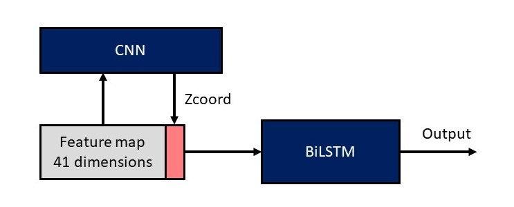
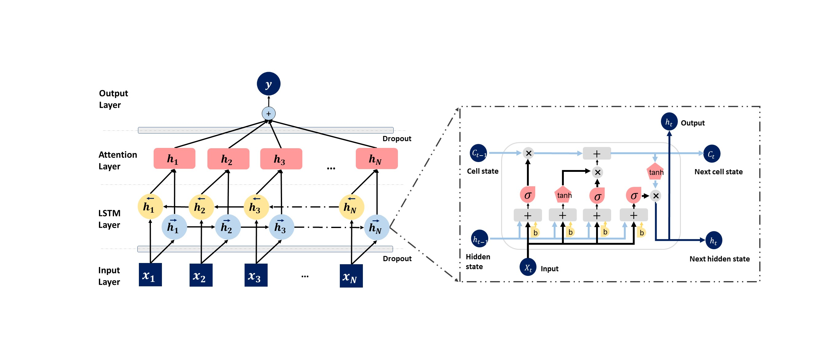

# TMP-SSurface-2.0

A Deep Learning-Based Predictor for Surface Accessibility of Transmembrane Protein Residues.
<p align="center"></p>
<p align="center"></p>

## Download data

We provide the test dataset used in this study,  you can download test.fasta to evaluate our method.

## Quick Start

### Requirements
- Python ≥ 3.6
- Tensorflow and Keras
- Psi-Blast for generating PSSM files

### Testing & Evaluation in Command Line
We provide run.py that is able to run pre-trained models. Run it with:
```
python run.py -f sample/sample.fasta -p sample/pssm/ -o results/
```

* To set the path of fasta file, use `--fasta` or `-f`.
* To set the path of generated PSSM files, use `--pssm_path` or `-p`.
* To save outputs to a directory, use `--output` or `-o`.

## Progress
- [x] README for running TMP-SSurface-2.0.
